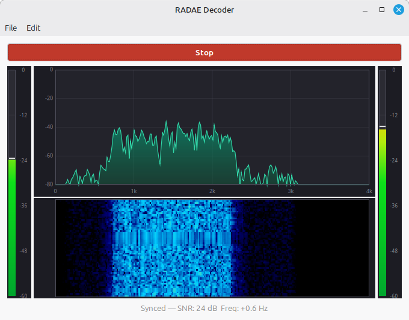

# RADAE Decoder

Originally from: https://github.com/peterbmarks/radae_decoder 

Based on code from: https://github.com/drowe67/radae

A real-time RADAE (Radio Autoencoder) decoder for Linux. Captures RADAE modem audio from an ALSA input device, decodes it using a neural OFDM demodulator and FARGAN vocoder, and plays the decoded speech on an ALSA output device. Includes a GTK3 level meter showing decoded audio levels, sync status, and SNR.

   




[Video demo](https://youtu.be/Q1SExfmMqZ0?si=LSMlgETFaZ1H1Fn5)

Unlike the official FreeDV app, this program uses an experimental C port of the python code and does
not require python to run. It's (currently) a statically linked single binary of just 11MB compared to
600MB. (But, of course, it does far far less).

## Features

- **Real-time RADAE decoding** — Full receive pipeline: Hilbert transform, OFDM demodulation, neural decoder, FARGAN speech synthesis
- **Dual device selection** — Pick any ALSA capture device (modem input) and playback device (decoded speech output)
- **Automatic signal acquisition** — Searches for RADAE signal, locks on when found, re-acquires after signal loss
- **Live status display** — Shows sync state, SNR (dB), and frequency offset (Hz) while decoding
- **Input level meter** — Calibrated dB scale (-60 to 0 dB) with peak hold, showing input audio level
- **Spectrum display** — Shows 4KHz of audio spectrum. With a RADAE signal you should see energy concentrated in the OFDM band around 1.3 kHz. 
- **Waterfall display** — Same as the spectrum but with vertical history
- **Output level meter** — Calibrated dB scale (-60 to 0 dB) with peak hold, showing decoded output levels
- **Sample rate flexibility** — Accepts any ALSA-supported input/output rate; internally resamples to/from the 8 kHz modem and 16 kHz speech rates

## How it works

```
ALSA Input (any rate, mono)
  -> Resample to 8 kHz
  -> Hilbert transform (127-tap FIR) -> complex IQ
  -> RADE receiver (pilot acquisition, OFDM demod, neural decoder)
  -> FARGAN vocoder -> 16 kHz mono speech
  -> Resample to output device rate
  -> ALSA Output
```

The RADAE codec uses a 30-carrier OFDM waveform in ~1.3 kHz bandwidth. Each 120 ms modem frame produces 12 speech frames (10 ms each) via the neural decoder and FARGAN vocoder. Pilot symbols enable automatic frequency and timing synchronization.

## Requirements

### Runtime
- Linux (tested on Ubuntu 24.04 / Linux Mint)
- GTK 3.24+
- ALSA runtime library (`libasound2`)
- X11 or Wayland display server

### Build-time
- CMake 3.16+
- C++17 compiler (GCC 7+, Clang 5+)
- C11 compiler
- Internet connection (first build downloads and compiles Opus with FARGAN/LPCNet support)
- Autotools (`autoconf`, `automake`, `libtool`) for building Opus
- Development headers:
  - `libgtk-3-dev`
  - `libasound2-dev`
  - `libcairo2-dev` (usually pulled in by GTK3)

### Install dependencies (Debian/Ubuntu)
```bash
sudo apt-get install build-essential cmake \
  libgtk-3-dev libasound2-dev pkg-config \
  autoconf automake libtool
```

## Build Instructions

```bash
cd radae_decoder

mkdir -p build
cd build
cmake -DCMAKE_BUILD_TYPE=Release -Wno-dev ..

# First build downloads Opus (~175 MB) and compiles everything.
# The NN weight files (rade_enc_data.c, rade_dec_data.c) are ~47 MB
# and take a while to compile.
make -j$(nproc)

# Binary is now at: build/radae_decoder
```

### Environment quirks

On some systems, pkg-config can't find `.pc` files in `/usr/lib/x86_64-linux-gnu/pkgconfig`. The CMakeLists.txt handles this automatically, but if you encounter issues:

```bash
export PKG_CONFIG_PATH=/usr/lib/x86_64-linux-gnu/pkgconfig
cmake ..
```

## Usage

```bash
./build/radae_decoder
```

### First run

1. **Input dropdown** -- Select the ALSA capture device receiving the RADAE modem signal (e.g. a sound card connected to a radio receiver).
2. **Output dropdown** -- Select the ALSA playback device for decoded speech (e.g. speakers or headphones).
3. **Start button** -- Click to begin decoding. The button turns red and changes to "Stop".
4. **Status bar** -- Shows "Searching for signal..." until a RADAE signal is detected, then displays "Synced -- SNR: X dB  Freq: +Y Hz".
5. **Meter display** -- Shows decoded output audio levels in real-time once synced.
6. **Refresh button** -- Re-scan for devices if you plug in new hardware.

The chosen input and output audio device names are saved and loaded on launch. If both are found
decoding will automatically start.

### Permissions

If you see "Failed to open audio devices", ensure your user is in the `audio` group:

```bash
sudo usermod -a -G audio $USER
# Log out and back in for the change to take effect
```

## Architecture

### Code structure

```
radae_decoder/
├── CMakeLists.txt              # Top-level build (GTK, ALSA, radae_nopy)
├── README.md
├── src/
│   ├── main.cpp                # GTK application, UI, event handlers
│   ├── rade_decoder.h/cpp      # RADAE decode pipeline (capture -> decode -> playback)
│   ├── audio_input.h/cpp       # ALSA device enumeration
│   └── meter_widget.h/cpp      # Cairo-based stereo bar meter widget
└── radae_nopy/                 # RADAE codec library (C, builds librade + opus)
    ├── CMakeLists.txt
    ├── cmake/BuildOpus.cmake   # Downloads & builds Opus with FARGAN/LPCNet
    └── src/
        ├── rade_api.h          # Public C API
        ├── rade_rx.c           # Receiver (sync state machine, OFDM demod)
        ├── rade_enc/dec*.c     # Neural encoder/decoder + compiled weights
        ├── rade_ofdm.c         # OFDM modulation/demodulation
        ├── rade_acq.c          # Pilot acquisition & tracking
        └── ...
```

### Component overview

| Module | Responsibility |
|--------|---------------|
| **rade_decoder** | Complete real-time decode pipeline: ALSA capture, resampling (any rate to 8 kHz), Hilbert transform (real to IQ), RADE receiver, FARGAN vocoder synthesis, resampling (16 kHz to output rate), ALSA playback. Runs on a dedicated thread with atomic status variables. |
| **audio_input** | ALSA device enumeration (capture and playback devices) via `snd_card_next()` / `snd_ctl_pcm_next_device()` |
| **meter_widget** | Custom `GtkDrawingArea` widget; redraws at ~30 fps using Cairo; converts linear RMS to logarithmic dB; green-to-red gradient fill; peak-hold with decay |
| **main** | GTK application shell; connects signals; manages device combo boxes; starts/stops decoder; updates meter and status via GLib timer |
| **radae_nopy (librade)** | RADAE codec C library: OFDM mod/demod, pilot acquisition, neural encoder/decoder (GRU+Conv), bandpass filter. Neural network weights compiled directly into the binary (~47 MB). |

### Decode pipeline

```
ALSA Input (hw:X,Y)
  | snd_pcm_readi() -- blocking read, S16_LE mono
  v
Linear interpolation resample (input rate -> 8 kHz)
  v
Hilbert transform (127-tap Hamming-windowed FIR)
  -> RADE_COMP (complex IQ samples)
  v
rade_rx() -- pilot acquisition, OFDM demod, neural decoder
  -> 36-float feature vectors (12 per modem frame, when synced)
  v
FARGAN vocoder (fargan_synthesize)
  -> 160 float samples per frame @ 16 kHz (10 ms)
  v
Linear interpolation resample (16 kHz -> output rate)
  v
snd_pcm_writei() -- ALSA playback, S16_LE mono
```

### Sync state machine

The RADE receiver has three states:

1. **SEARCH** -- Correlates incoming signal against pilot patterns across 40 frequency bins (+-100 Hz range, 2.5 Hz steps)
2. **CANDIDATE** -- Validates detected signal over multiple frames, refines timing and frequency
3. **SYNC** -- Locked and demodulating. Continuously tracks pilots. Loses sync if pilots fail for 3 seconds.

When sync is lost, the FARGAN vocoder is re-initialized so it can warm up cleanly when the next signal is acquired (5-frame warm-up via `fargan_cont()`).

### Thread model

- **Processing thread** (RadaeDecoder): Runs the entire capture-decode-playback loop
- **GTK main thread**: Reads atomic status variables at 30 Hz, updates meter and status label
- **Synchronization**: `std::atomic<float>` / `std::atomic<bool>` with relaxed ordering (lock-free)

## Troubleshooting

### "Package 'gtk+-3.0' not found"
Your pkg-config search path is missing the multiarch directory:
```bash
export PKG_CONFIG_PATH=/usr/lib/x86_64-linux-gnu/pkgconfig
```

### "Failed to open audio devices"
- Check permissions: `groups` should list `audio`. If not: `sudo usermod -a -G audio $USER` and re-login.
- Verify devices exist: `arecord -l` (capture) and `aplay -l` (playback).
- Try different devices from the dropdowns.

### No audio output / stuck on "Searching for signal..."
- Ensure the input device is actually receiving a RADAE modem signal at the expected bandwidth (~1.3 kHz around baseband).
- Check that the input level is reasonable (not clipping, not too quiet).
- The signal must contain RADAE OFDM pilots for the receiver to lock on.

### Build fails downloading Opus
The first build downloads Opus source from GitHub (~175 MB). Ensure you have an internet connection. If behind a proxy, set `http_proxy`/`https_proxy` environment variables.

### Build takes a long time
The neural network weight files (`rade_enc_data.c`, `rade_dec_data.c`) are ~24 MB and ~23 MB respectively. Compiling these takes significant time and memory. Use `make -j$(nproc)` for parallel builds.

## Technical details

### RADAE modem parameters
- **Sample rate**: 8000 Hz (modem), 16000 Hz (speech)
- **OFDM carriers**: 30
- **Bandwidth**: ~1.3 kHz
- **Modem frame**: 960 samples @ 8 kHz (120 ms)
- **Latent dimension**: 80 (neural autoencoder bottleneck)
- **Feature frames per modem frame**: 12 (3 latent vectors x 4 encoder stride)
- **Speech frame**: 160 samples @ 16 kHz (10 ms)

### ALSA configuration
- **Access mode**: `SND_PCM_ACCESS_RW_INTERLEAVED`
- **Format**: `SND_PCM_FORMAT_S16_LE`
- **Capture rate**: Prefers 8 kHz; accepts any rate and resamples
- **Playback rate**: Prefers 16 kHz; accepts any rate and resamples
- **Channels**: 1 (mono)

## Demo tools

### RADE Demod: WAV RADE → WAV Speech Audio
Take a wav file off air and produce a demodulated wav file

Usage:
```
rade_demod [-v 0|1|2] <input.wav> <output.wav>
```

### RADE Modulate: WAV Speech Audio → WAV RADE
Take a wav file with speech in it and produce a RADE OFDM encoded output wav file ready for transmission.

Usage:
```
rade_modulate [-v 0|1|2] <intput.wav> <output.wav>
```

### Encode: WAV → IQ
```
sox ../voice.wav -r 16000 -t .s16 -c 1 - | \
  ./src/lpcnet_demo -features /dev/stdin - | \
  ./src/radae_tx > tx.iq
```

### Decode: IQ → WAV  
```
cat tx.iq | \
  ./src/radae_rx | \
  ./src/lpcnet_demo -fargan-synthesis /dev/stdin - | \
  sox -t .s16 -r 16000 -c 1 - decoded.wav
```

### Decode: WAV RADE → WAV (multiple steps)
```
usage: radae_rx [options]
  -h, --help           Show this help
  --model_name FILE    Path to model (ignored, uses built-in weights)
  -v LEVEL             Verbosity level (0, 1, or 2)
  --no-unsync          Disable automatic unsync
```

```
sox ../FDV_offair.wav -r 8000 -e float -b 32 -c 1 -t raw - | \
./src/real2iq | \
./src/radae_rx > features.f32
./src/lpcnet_demo -fargan-synthesis features.f32 - | \
sox -t .s16 -r 16000 -c 1 - decoded.wav
play decoded.wav
```

## Credits

- RADAE codec by David Rowe ([github.com/drowe67](https://github.com/drowe67))
- Opus/LPCNet/FARGAN by Xiph.Org / Amazon ([opus-codec.org](https://opus-codec.org/))
- Built with GTK 3 ([gtk.org](https://www.gtk.org/))
- Audio I/O via ALSA ([alsa-project.org](https://www.alsa-project.org/))
- Thanks David Rowe for help and encouragement.

---

**Platform**: Linux (Ubuntu 24.04 / Linux Mint)
