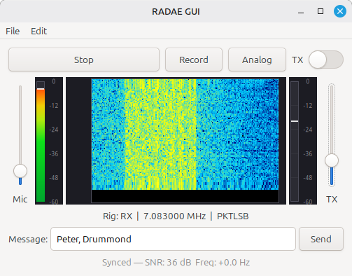

# RADAE Gui

Originally from: https://github.com/peterbmarks/radae_decoder

Based on code from: https://github.com/drowe67/radae

A real-time RADAE (Radio Autoencoder) encoder and decoder for Linux. In receive (RX) mode it captures RADAE modem audio from an audio input device, decodes it using a neural OFDM demodulator and FARGAN vocoder, and plays the decoded speech on an audio output device. In transmit (TX) mode it captures speech from a microphone, extracts LPCNet features, encodes them with the RADE neural encoder, and outputs the OFDM modem signal to a radio. Includes a GTK3 UI with level meters, spectrum/waterfall displays, sync status, SNR, and a TX output level slider.

   





[Video demo](https://youtu.be/Q1SExfmMqZ0?si=LSMlgETFaZ1H1Fn5)

Unlike the official FreeDV app, this program uses an experimental C port of the python code and does
not require python to run. It's (currently) a statically linked single binary of just 11MB compared to
600MB. (But, of course, it does far far less).

## Features

### Receive (RX)
- **Real-time RADAE decoding** — Full receive pipeline: Hilbert transform, OFDM demodulation, neural decoder, FARGAN speech synthesis
- **Dual device selection** — Pick any capture device (modem input) and playback device (decoded speech output)
- **Automatic signal acquisition** — Searches for RADAE signal, locks on when found, re-acquires after signal loss
- **Live status display** — Shows sync state, SNR (dB), and frequency offset (Hz) while decoding
- **Open WAV file recording** — Decodes and plays a WAV file recording such as those from the FreeDV app

### Transmit (TX)
- **Real-time RADAE encoding** — Full transmit pipeline: microphone capture, LPCNet feature extraction, neural RADE encoder, OFDM modulation
- **Dual device selection** — Pick any capture device (microphone) and playback device (radio transmit audio)
- **TX output level slider** — Adjustable output level (0–100%) to set the drive level to the radio; saved across sessions
- **TX bandpass filter** — Switchable 700–2300 Hz bandpass filter on the TX output, applied just before the audio is sent to the radio. Uses a 101-tap FIR filter at 8 kHz to sharply limit the transmitted bandwidth. Toggled via the BPF switch in the main window; setting is saved across sessions
- **End-of-over signalling** — Automatically sends an EOO frame when transmission stops

### Common
- **Input & output level meters** — Calibrated dB scale (-60 to 0 dB) with peak hold
- **Spectrum display** — Shows 4 kHz of audio spectrum. With a RADAE signal you should see energy concentrated in the OFDM band around 1.3 kHz
- **Waterfall display** — Same as the spectrum but with vertical history
- **Sample rate flexibility** — The audio backend handles sample rate conversion where supported; internally works at 8 kHz modem and 16 kHz speech rates
- **Settings persistence** — Device selections and TX level are saved to `~/.config/radae-decoder.conf`

## How it works

### RX (Decode)
```
Audio Input (8 kHz mono)
  -> Hilbert transform (127-tap FIR) -> complex IQ
  -> RADE receiver (pilot acquisition, OFDM demod, neural decoder)
  -> FARGAN vocoder -> 16 kHz mono speech
  -> Audio Output
```

### TX (Encode)
```
Mic Input (16 kHz mono)
  -> LPCNet feature extraction (36 features per 10 ms frame)
  -> Accumulate 12 feature frames (120 ms)
  -> RADE transmitter (neural encoder, OFDM modulation)
  -> 960 complex IQ samples @ 8 kHz
  -> [Optional] 700–2300 Hz bandpass filter (101-tap FIR, toggled by BPF switch)
  -> Take real part, scale by TX output level
  -> Radio Audio Output
```

The RADAE codec uses a 30-carrier OFDM waveform in ~1.3 kHz bandwidth. Each 120 ms modem frame produces 12 speech frames (10 ms each) via the neural decoder and FARGAN vocoder. Pilot symbols enable automatic frequency and timing synchronization.

## Requirements

### Runtime
- Linux (tested on Ubuntu 24.04 / Linux Mint)
- GTK 3.24+
- ALSA runtime libraries (`libasound2`) — default audio backend
  - PulseAudio (`libpulse0`) if built with `-DAUDIO_BACKEND=PULSE`
  - PortAudio if built with `-DAUDIO_BACKEND=PORTAUDIO`
- X11 or Wayland display server

### Build-time
- CMake 3.16+
- C++17 compiler (GCC 7+, Clang 5+)
- C11 compiler
- Internet connection (first build downloads and compiles Opus with FARGAN/LPCNet support)
- Autotools (`autoconf`, `automake`, `libtool`) for building Opus
- Development headers:
  - `libgtk-3-dev`
  - `libasound2-dev` (if using `-DAUDIO_BACKEND=ALSA`)
  - `libpulse-dev` (if using `-DAUDIO_BACKEND=PULSE` default on Linux)
  - `libcairo2-dev` (usually pulled in by GTK3)

### Install dependencies (Debian/Ubuntu)
```bash
# Default (ALSA backend)
sudo apt-get install build-essential cmake \
  libgtk-3-dev libasound2-dev pkg-config \
  autoconf automake libtool

# Optional: PulseAudio backend
sudo apt-get install libpulse-dev
```

## Build Instructions

```bash
cd radae_decoder

mkdir -p build
cd build
cmake -DCMAKE_BUILD_TYPE=Release -Wno-dev ..

# First build downloads Opus (~175 MB) and compiles everything.
# The NN weight files (rade_enc_data.c, rade_dec_data.c) are ~47 MB
# and take a while to compile.
make -j$(nproc)

# Binary is now at: build/RADAE_Gui
```

### Audio backend selection

The audio backend is selected at configure time via `-DAUDIO_BACKEND=`:

| Value | Default on | Library needed |
|-------|-----------|----------------|
| `ALSA` | Linux | `libasound2-dev` |
| `PULSE` | — | `libpulse-dev` |
| `PORTAUDIO` | macOS | `portaudio19-dev` |

```bash
# Linux default (PULSE)
cmake -DCMAKE_BUILD_TYPE=Release ..

# Explicitly choose PulseAudio on Linux
cmake -DCMAKE_BUILD_TYPE=Release -DAUDIO_BACKEND=PULSE ..

# Explicitly choose ALSA on Linux
cmake -DCMAKE_BUILD_TYPE=Release -DAUDIO_BACKEND=ALSA ..

# PortAudio (macOS default, also available on Linux)
cmake -DCMAKE_BUILD_TYPE=Release -DAUDIO_BACKEND=PORTAUDIO ..
```

The selected backend is printed during configuration:
```
-- Audio backend: PULSE
```

Note when using ALSA you should choose devices with plughw: prefix so they can do their own sample
rate conversion.

Note: once a build directory has been configured, CMake caches `AUDIO_BACKEND`. Delete `CMakeCache.txt` or the build directory before switching backends.

### Environment quirks

On some systems, pkg-config can't find `.pc` files in `/usr/lib/x86_64-linux-gnu/pkgconfig`. The CMakeLists.txt handles this automatically, but if you encounter issues:

```bash
export PKG_CONFIG_PATH=/usr/lib/x86_64-linux-gnu/pkgconfig
cmake ..
```

## Usage

```bash
./build/RADAE_Gui
```

### First run (RX)

1. **Input dropdown** -- Select the capture device receiving the RADAE modem signal (e.g. a sound card connected to a radio receiver).
2. **Output dropdown** -- Select the playback device for decoded speech (e.g. speakers or headphones).
3. **Start button** -- Click to begin decoding. The button turns red and changes to "Stop".
4. **Status bar** -- Shows "Searching for signal..." until a RADAE signal is detected, then displays "Synced -- SNR: X dB  Freq: +Y Hz".
5. **Meter display** -- Shows decoded output audio levels in real-time once synced.
6. **Refresh button** -- Re-scan for devices if you plug in new hardware.

The chosen input and output audio device names are saved and loaded on launch. If both are found
decoding will automatically start.

### Transmitting (TX)

1. Toggle the **TX switch** to enable transmit mode. The settings dialog gains TX-specific device selectors.
2. **TX Input** -- Select the microphone capture device.
3. **TX Output** -- Select the playback device connected to the radio transmitter.
4. **TX level slider** -- Adjust the output drive level (right side of window). The setting is saved across sessions.
5. **BPF switch** -- Toggle the 700–2300 Hz bandpass filter on the TX output. This limits the transmitted bandwidth to the SSB passband. The setting is saved across sessions.
6. Click **Start** to begin transmitting. The status bar shows "Transmitting..." and the meters show mic input and modem output levels.
7. Click **Stop** to end the transmission; an end-of-over (EOO) frame is sent automatically.

### Permissions

If you see "Failed to open audio devices":
- **ALSA**: Ensure your user is in the `audio` group (`sudo usermod -aG audio $USER`, then log out and back in).
- **PulseAudio**: Ensure PulseAudio is running (`pulseaudio --check` or `pactl info`).

## radae_headless — Headless Transceiver

`radae_headless` is a command-line tool that runs the full RADAE encode/decode pipeline without a graphical interface. It is useful for headless servers, automation, or embedded deployments where a display is unavailable.

```bash
./build/radae_headless [options]
```

### Options

| Option | Description |
|--------|-------------|
| `-h`, `--help` | Show help and exit |
| `-d`, `--devices` | List available audio devices and exit |
| `-c FILE` | Config file path (default: `radae_headless.conf`) |
| `-t` | Transmit mode (default is receive mode) |
| `--fromradio DEVICE` | Audio input device receiving the RADAE modem signal (RX) |
| `--tospeaker DEVICE` | Audio output device for decoded speech (RX) |
| `--frommic DEVICE` | Audio input device for the microphone (TX) |
| `--toradio DEVICE` | Audio output device connected to the radio transmitter (TX) |
| `--call CALLSIGN` | Your callsign (e.g. `VK3TPM`) — saved to the config file |

### Modes

**Receive (RX)** — default mode. Requires `--fromradio` and `--tospeaker`:

```bash
./build/radae_headless --fromradio alsa_input.usb-radio --tospeaker alsa_output.pci-speakers
```

**Transmit (TX)** — enabled with `-t`. Requires `--frommic` and `--toradio`:

```bash
./build/radae_headless -t --frommic alsa_input.pci-mic --toradio alsa_output.usb-radio
```

Use `--devices` to discover the correct device names for your system:

```bash
./build/radae_headless --devices
```

### Configuration file

Settings are persisted to `radae_headless.conf` (or the file given with `-c`). If the config file does not exist and device options are supplied on the command line, the file is created automatically.

The config file format is `key=value`, one per line; lines beginning with `#` are comments:

```ini
# radae_headless configuration
fromradio=alsa_input.usb-radio
tospeaker=alsa_output.pci-speakers
frommic=alsa_input.pci-mic
toradio=alsa_output.usb-radio
call=VK3TPM
```

Command-line options always override values in the config file.

### Status output

While running, the tool prints a live status line to `stderr` every second:

```
SYNC SNR: 12.3 dB  Freq: +1.5 Hz  In: 0.45  Out: 0.62
```

`SYNC` becomes `----` when the receiver has not yet locked on to a signal. Press **Ctrl+C** to stop cleanly (an EOO frame is sent automatically in TX mode).

## Architecture

### Code structure

```
radae_decoder/
├── CMakeLists.txt              # Top-level build (GTK, audio backend, radae)
├── README.md
├── src/
│   ├── main.cpp                # GTK application, UI, event handlers
│   ├── rade_decoder.h/cpp      # RADAE decode pipeline (capture -> decode -> playback)
│   ├── rade_encoder.h/cpp      # RADAE encode pipeline (mic -> encode -> radio)
│   ├── audio_input.h/cpp       # Audio device enumeration helper
│   ├── audio_stream.h          # AudioStream abstract interface
│   ├── audio_stream_alsa.cpp   # ALSA backend (Linux default)
│   ├── audio_stream_pulse.cpp  # PulseAudio backend
│   ├── audio_stream_portaudio.cpp  # PortAudio backend (macOS default)
│   ├── meter_widget.h/cpp      # Cairo-based bar meter widget
│   ├── spectrum_widget.h/cpp   # Cairo-based spectrum display
│   └── waterfall_widget.h/cpp  # Cairo-based waterfall display
└── radae_nopy/                 # RADAE codec library (C, builds librade + opus)
    ├── CMakeLists.txt
    ├── cmake/BuildOpus.cmake   # Downloads & builds Opus with FARGAN/LPCNet
    └── src/
        ├── rade_api.h          # Public C API
        ├── rade_rx.c           # Receiver (sync state machine, OFDM demod)
        ├── rade_enc/dec*.c     # Neural encoder/decoder + compiled weights
        ├── rade_ofdm.c         # OFDM modulation/demodulation
        ├── rade_acq.c          # Pilot acquisition & tracking
        └── ...
```

### Component overview

| Module | Responsibility |
|--------|---------------|
| **rade_decoder** | Complete real-time decode pipeline: audio capture (8 kHz), Hilbert transform (real to IQ), RADE receiver, FARGAN vocoder synthesis, audio playback (16 kHz). Runs on a dedicated thread with atomic status variables. |
| **rade_encoder** | Complete real-time encode pipeline: mic capture (16 kHz), LPCNet feature extraction, RADE transmitter (neural encoder + OFDM mod), audio playback to radio (8 kHz). Runs on a dedicated thread; TX output level controlled via atomic. |
| **audio_stream** | Backend-neutral `AudioStream` class. Compiled against one of: `audio_stream_alsa.cpp`, `audio_stream_pulse.cpp`, or `audio_stream_portaudio.cpp` depending on `AUDIO_BACKEND`. |
| **audio_input** | Device enumeration wrapper used by the UI dropdowns |
| **meter_widget** | Custom `GtkDrawingArea` widget; redraws at ~30 fps using Cairo; converts linear RMS to logarithmic dB; green-to-red gradient fill; peak-hold with decay |
| **main** | GTK application shell; connects signals; manages device combo boxes and TX level slider; starts/stops decoder/encoder; updates meters and status via GLib timer |
| **radae_nopy (librade)** | RADAE codec C library: OFDM mod/demod, pilot acquisition, neural encoder/decoder (GRU+Conv), bandpass filter. Neural network weights compiled directly into the binary (~47 MB). |

### Decode pipeline (RX)

```
Audio Input (8 kHz mono)
  | AudioStream::read() -- blocking read, S16_LE mono
  v
Hilbert transform (127-tap Hamming-windowed FIR)
  -> RADE_COMP (complex IQ samples)
  v
rade_rx() -- pilot acquisition, OFDM demod, neural decoder
  -> 36-float feature vectors (12 per modem frame, when synced)
  v
FARGAN vocoder (fargan_synthesize)
  -> 160 float samples per frame @ 16 kHz (10 ms)
  v
AudioStream::write() -- audio playback, S16_LE mono
```

### Encode pipeline (TX)

```
Mic Input (16 kHz mono)
  | AudioStream::read() -- blocking read, S16_LE mono
  v
lpcnet_compute_single_frame_features()
  -> 36-float feature vector per 160 samples (10 ms)
  v
Accumulate 12 feature frames (432 floats, 120 ms)
  v
rade_tx() -- neural encoder, OFDM modulation
  -> 960 RADE_COMP samples @ 8 kHz (120 ms)
  v
[Optional] rade_bpf_process() -- 700-2300 Hz BPF (101-tap FIR, toggled by BPF switch)
  v
Take real part, scale by TX level slider
  v
AudioStream::write() -- audio playback to radio, S16_LE mono
```

### Sync state machine

The RADE receiver has three states:

1. **SEARCH** -- Correlates incoming signal against pilot patterns across 40 frequency bins (+-100 Hz range, 2.5 Hz steps)
2. **CANDIDATE** -- Validates detected signal over multiple frames, refines timing and frequency
3. **SYNC** -- Locked and demodulating. Continuously tracks pilots. Loses sync if pilots fail for 3 seconds.

When sync is lost, the FARGAN vocoder is re-initialized so it can warm up cleanly when the next signal is acquired (5-frame warm-up via `fargan_cont()`).

### Thread model

- **RX processing thread** (RadaeDecoder): Runs the entire capture-decode-playback loop
- **TX processing thread** (RadaeEncoder): Runs the entire mic-capture-encode-playback loop
- **GTK main thread**: Reads atomic status variables at 30 Hz, updates meters, status label, and writes TX scale from the slider
- **Synchronization**: `std::atomic<float>` / `std::atomic<bool>` with relaxed ordering (lock-free)

## Troubleshooting

### "Package 'gtk+-3.0' not found"
Your pkg-config search path is missing the multiarch directory:
```bash
export PKG_CONFIG_PATH=/usr/lib/x86_64-linux-gnu/pkgconfig
```

### "Failed to open audio devices" (ALSA)
- List available capture devices: `arecord -L`
- List available playback devices: `aplay -L`
- Ensure your user is in the `audio` group: `groups $USER`
- Try the `default` device, or a specific `hw:X,Y` or `plughw:X,Y` identifier from `arecord -l`.

### "Failed to open audio devices" (PulseAudio)
- Ensure PulseAudio is running: `pulseaudio --check` or `pactl info`.
- Verify devices exist: `pactl list sources short` (capture) and `pactl list sinks short` (playback).
- Try different devices from the dropdowns.

### No audio output / stuck on "Searching for signal..."
- Ensure the input device is actually receiving a RADAE modem signal at the expected bandwidth (~1.3 kHz around baseband).
- Check that the input level is reasonable (not clipping, not too quiet).
- The signal must contain RADAE OFDM pilots for the receiver to lock on.

### Build fails downloading Opus
The first build downloads Opus source from GitHub (~175 MB). Ensure you have an internet connection. If behind a proxy, set `http_proxy`/`https_proxy` environment variables.

### Build takes a long time
The neural network weight files (`rade_enc_data.c`, `rade_dec_data.c`) are ~24 MB and ~23 MB respectively. Compiling these takes significant time and memory. Use `make -j$(nproc)` for parallel builds.

## Technical details

### RADAE modem parameters
- **Sample rate**: 8000 Hz (modem), 16000 Hz (speech)
- **OFDM carriers**: 30
- **Bandwidth**: ~1.3 kHz
- **Modem frame**: 960 samples @ 8 kHz (120 ms)
- **Latent dimension**: 80 (neural autoencoder bottleneck)
- **Feature frames per modem frame**: 12 (3 latent vectors x 4 encoder stride)
- **Speech frame**: 160 samples @ 16 kHz (10 ms)

### Audio backend configuration

| Backend | API | Format | Notes |
|---------|-----|--------|-------|
| ALSA | `snd_pcm_readi` / `snd_pcm_writei` | `SND_PCM_FORMAT_S16_LE` | Linux default; direct hardware access, low latency |
| PulseAudio | `pa_simple_read` / `pa_simple_write` | `PA_SAMPLE_S16LE` | Server-managed; handles rate conversion automatically |
| PortAudio | `Pa_ReadStream` / `Pa_WriteStream` | `paInt16` | macOS default; cross-platform |

All three backends present the same `AudioStream` interface to the rest of the application.

## Demo tools

### RADE Demod: WAV RADE → WAV Speech Audio
Take a wav file off air and produce a demodulated wav file

Usage:
```
rade_demod [-v 0|1|2] <input.wav> <output.wav>
```

### RADE Modulate: WAV Speech Audio → WAV RADE
Take a wav file with speech in it and produce a RADE OFDM encoded output wav file ready for transmission.

Usage:
```
rade_modulate [-v 0|1|2] <intput.wav> <output.wav>
```

### Encode: WAV → IQ
```
sox ../voice.wav -r 16000 -t .s16 -c 1 - | \
  ./src/lpcnet_demo -features /dev/stdin - | \
  ./src/radae_tx > tx.iq
```

### Decode: IQ → WAV
```
cat tx.iq | \
  ./src/radae_rx | \
  ./src/lpcnet_demo -fargan-synthesis /dev/stdin - | \
  sox -t .s16 -r 16000 -c 1 - decoded.wav
```

### Decode: WAV RADE → WAV (multiple steps)
```
usage: radae_rx [options]
  -h, --help           Show this help
  --model_name FILE    Path to model (ignored, uses built-in weights)
  -v LEVEL             Verbosity level (0, 1, or 2)
  --no-unsync          Disable automatic unsync
```

```
sox ../FDV_offair.wav -r 8000 -e float -b 32 -c 1 -t raw - | \
./src/real2iq | \
./src/radae_rx > features.f32
./src/lpcnet_demo -fargan-synthesis features.f32 - | \
sox -t .s16 -r 16000 -c 1 - decoded.wav
play decoded.wav
```

### Decode 8kHz int-16 samples from stdin (for OpenWebRX)

```
./webrx_rade_decode -h
usage: webrx_rade_decode [options]

  Reads 16-bit signed mono audio at 8000 Hz from stdin,
  decodes RADAE, and writes 16-bit signed mono audio
  at 8000 Hz to stdout.

options:
  -h, --help     Show this help
  -v LEVEL       Verbosity: 0=quiet  1=normal (default)  2=verbose
```

Test:
```sox FDV_FromRadio_20260125-080557_local.wav \
-t raw -b 16 -r 8000 -e signed-integer - | \
./webrx_rade_decode |sox -t raw -r 8000 -b 16 -e signed-integer -c 1 - output.wav
```

## Credits

- RADAE codec by David Rowe ([github.com/drowe67](https://github.com/drowe67))
- Opus/LPCNet/FARGAN by Xiph.Org / Amazon ([opus-codec.org](https://opus-codec.org/))
- Built with GTK 3 ([gtk.org](https://www.gtk.org/))
- Audio I/O via ALSA / PulseAudio / PortAudio (selectable at build time)
- Thanks David Rowe for help and encouragement.

---

**Platform**: Linux (Ubuntu 24.04 / Linux Mint)
